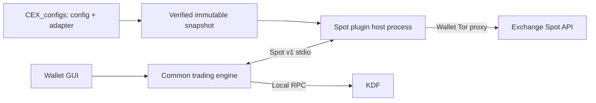

# Exchange boundary and read-only preview

## Responsibilities

The strategy engine consumes canonical Spot balances, symbol rules, order books,
orders and fills. Pricing, sizing, inventory reservation, hedging, journaling and
KDF reconciliation belong to the common engine.

The wallet now supplies a verified, immutable CEX plugin snapshot from the
separate `p2piratedotcom/CEX_configs` repository. Each entry contains public JSON
configuration plus a pure-Python adapter ZIP. `exchanges.create_client` selects
it from the catalog, with no venue registry edits. A bounded stdio client talks
to a separate plugin-host process inside the engine executable. The adapter
owns endpoints, signing and canonical Spot response translation. New exchanges
that implement protocol v1 require only plugin/catalog changes.

The historical bundled configuration/adapters remain **only for legacy CLI/TUI
invocations without an external catalog**, preserving existing deployments and
tests. The new GUI requires `plugin_protocol: 1` and an external catalog, and
probes the executable before passing wallet secrets/live flags. A corrupt or
incompatible catalog never falls back to bundled clients. CLI compatibility code
is not the source used for future GUI plugin enhancements.

[Spot v1 protocol and onboarding requirements](https://github.com/p2piratedotcom/CEX_configs/blob/main/PROTOCOL.md)
define normalized balances, rules, books, orders/fills, permitted methods,
deadlines, credentials and uncertainty semantics. Keys stay in Linux Secret
Service with existing MEXC/Gate namespaces; future venues receive their own
namespace. Private per-wallet/per-venue plugin state supports native nonce and
client-ID persistence. All adapter requests use the explicit wallet Tor route;
there is no direct fallback. Child processes isolate failures, **not arbitrary
malicious code**; repository publish access is trusted executable-code access.

Updating plugins requires pausing/withdrawing orders and stopping the engine,
with the existing active-swap refusal. The wallet clears its live preference and
restarts in preview with the new pinned snapshot. No hot code reload or automatic
live activation occurs. Existing installed snapshots work offline. Publish the
paired compatible engine, wallet and initial catalog before normal downloads;
existing engine releases without plugin protocol metadata are rejected.

Kraken/Binance are planned plugin implementations, not supported by this patch.
The contract currently accepts key+secret Spot credentials and USDT hedge
routes. Native aliases, precision filters, nonce coordination and client-ID
mapping belong to those plugins; products or credentials outside v1 need an
explicit versioned extension. See the catalog protocol's official API references.

Existing `Mexc*` names and ARRR fields in durable records remain compatibility
aliases: their removal would need a separate data migration. The current strategy
supports arbitrary configured KDF base/quote assets routed through Spot USDT
markets. This change does not claim derivatives or every possible quote asset.

## Data flow

## Preview fix

The GUI intentionally starts no live CEX worker in preview mode. Previously
sizing nevertheless demanded its live coverage lease, making preview impossible.
The strategy preview/capacity paths now use `PreviewBalances` when no fresh live
lease is available. It loads current credentials at request time (keys entered
after engine startup therefore work), performs only read requests, verifies
Spot account/authorized symbols, and caches balances for at most three seconds
from the start of the balance request. A balance request taking ten seconds is
rejected; completion cannot freshen an old sample.

The read-only snapshot is never accepted by the live CoverageGuard. Background
strategy publication still demands the signed live worker lease and all existing
hedge/reconciliation checks. Saving creates paused configuration only. Zero funds,
unsupported routes and API permission/network failures remain errors with actionable
messages and no reflected remote payloads or secrets.

Tor reads use bounded exchange-specific budgets rather than 1.7–2 second limits.
Wallet live leases are capped at 30 seconds; balances are dated at local request
start, not an exchange clock offset, and expiration remains fail closed.

The CEX worker can now operate with Gate credentials alone. All configured clients
are resolved through the same adapter factory; trading remains explicitly gated.

## Validation

Standalone tests exercise both venue adapters, read-only balance sizing, cache
age, failed/slow reads, secret redaction, and isolation from live publication.
Tests use fake exchanges and never place funded orders. End-to-end confirmation
against the user's actual MEXC account must be performed in preview mode after
installing the local candidate; automated checks do not prove account permissions.

API contract reference: https://mexcdevelop.github.io/apidocs/spot_v3_en/
(account information and authorized Spot symbols).

Verified local results: 16 standalone engine tests, 97 strategy tests and 6
hedging tests passed. The inherited coverage test file has the same four failures
against unchanged main and this candidate (stale single-argument `_read` fixtures);
these are recorded as preexisting failures, not successful checks.

## Local MEXC balance regression (2026-10-03)

Verified both credentials in the existing wallet Secret Service profile; no key
migration or re-entry was needed. Read-only MEXC requests through the wallet Tor
proxy succeeded. `selfSymbols` returned 1,822 entries, including symbols outside
the supported ASCII alphanumeric hedge namespace. Rejecting the complete list
prevented balance display before the account request was even made.

Balance display now reads the Spot account independently of hedge permissions
and accepts an account with read permission but without trading permission.
Preview filters unsupported symbol entries as the live coverage publisher does;
it does not authorize those entries. Live coverage still requires Spot trading
permission and fresh signed coverage. Regression tests cover unsupported pairs,
read-only accounts and empty balance lists. All 19 standalone tests passed;
a real read-only account query through Tor returned five asset rows.

## Local plugin verification (2026-10-04)

37 standalone engine tests pass, including an entirely synthetic third venue,
read-only/write gates, redaction, immutable catalog validation, private state,
client reuse, child cleanup and ambiguous writes without replay. MEXC/Gate ZIP
fixtures run separately in the catalog repository with no external requests.
These checks do not validate a funded exchange account or authorize live trading.
The Linux candidate advertises protocol 1 through `plugin-capabilities`.

Additional inherited core regression: **132 strategy/API/hedging/unwind tests
passed** with fake services and loopback HTTP. The inherited terminal PTY suite
has **2 passes and 2 failures**, identical against unchanged base
`e365642c3fc0395977b69f9ce02e1d8765243813` and this candidate:
`test_select_save_modify_start_back` and
`test_typing_q_resize_escape_and_terminal_restoration`. No TUI implementation
was changed by this patch; these failures are recorded, not counted as passes.
Initial sandbox HTTP-bind errors were resolved by running the fake loopback
server tests with the necessary local-network permissions.
